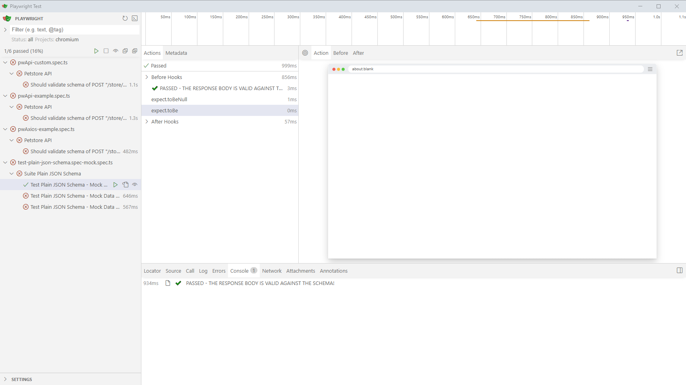
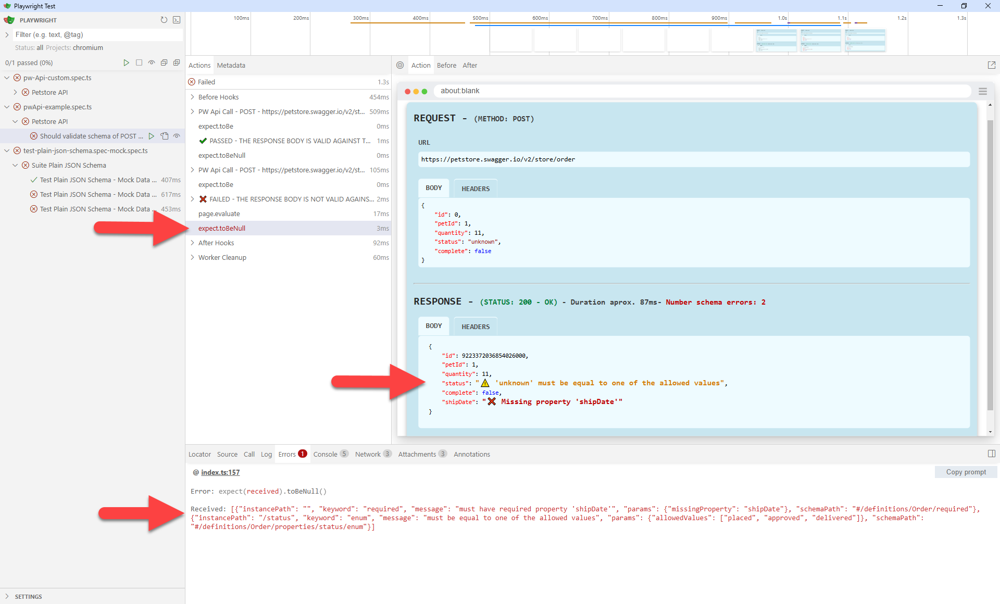
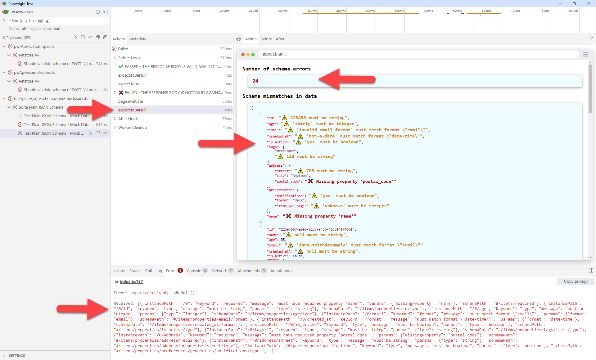
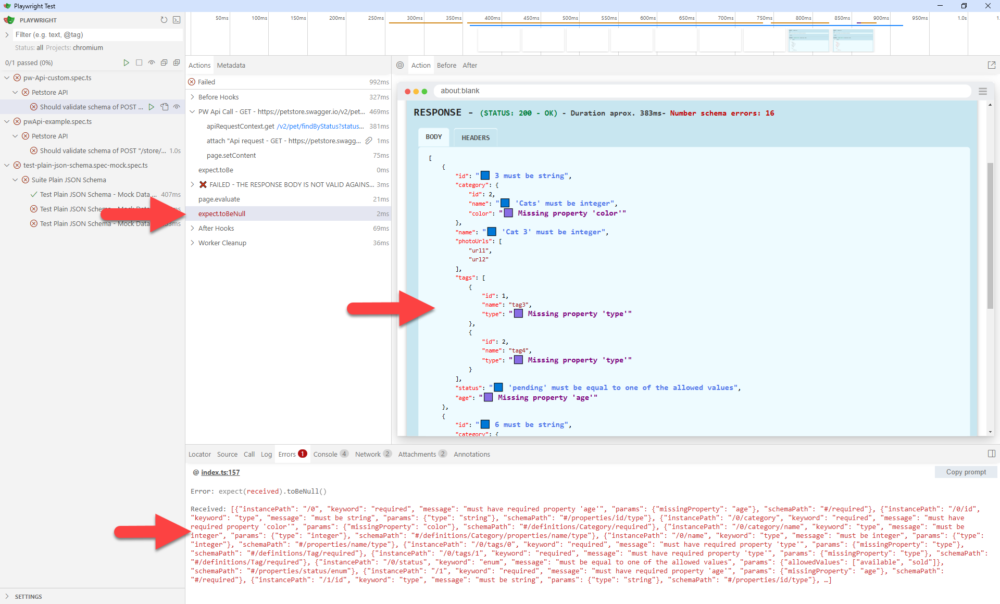
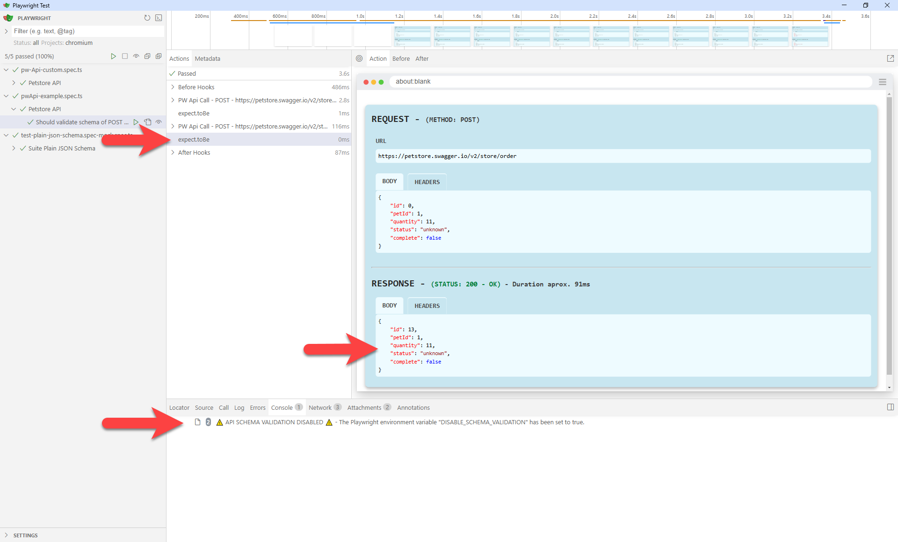
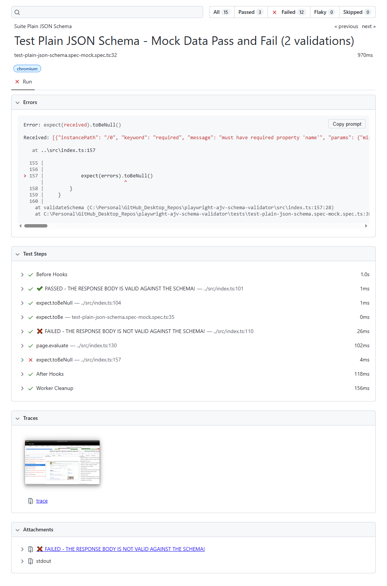
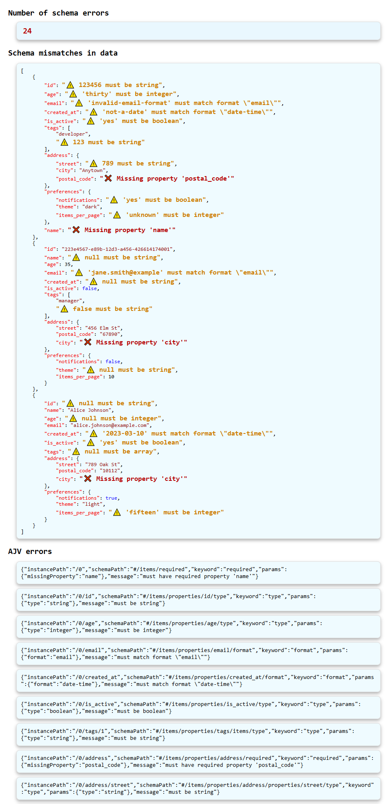
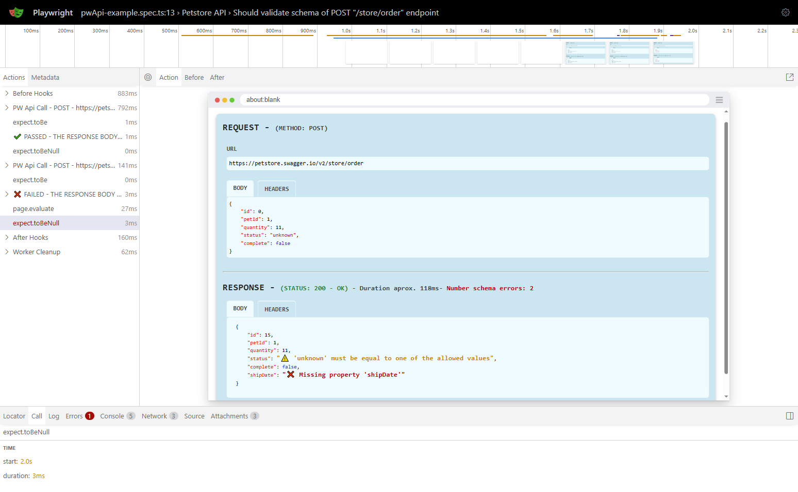
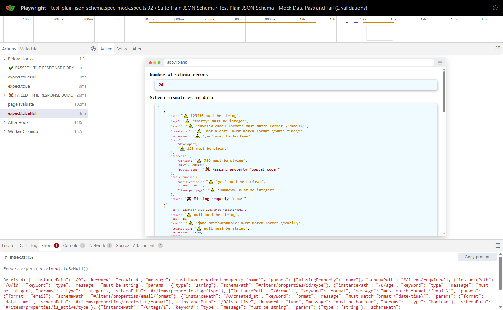

# playwright-ajv-schema-validator

A Playwright plugin for API schema validation against plain JSON schemas, Swagger schema documents. Built on the robust core-ajv-schema-validator plugin and powered by the Ajv JSON Schema Validator, it delivers results in a clear, user-friendly format, simplifying the process of identifying and addressing schema issues.

 


## MAIN FEATURES

- Function **`validateSchema()`** to report JSON Schema errors in the response obtained from network requests.

- Uses the **core-ajv-schema-validator** plugin, which leverages the **Ajv JSON Schema Validator** as its engine .
  
- Supports schemas provided as **plain JSON schema**, **OpenAPI 3 schema document** and **Swagger 2 schema document**.
  
- Provides a user-friendly view of schema errors and mismatches between the validated data and the JSON schema, clearly highlighting where each validation error occurred and the exact reason for the mismatch:
  -  Number of schema errors.
  -  Full list of schema errors as provided by Ajv.
  -  A nested tree view of the validated data, clearly indicating the errors and where they occurred in an easy-to-understand format.

- Environment variables:
  -  `DISABLE_SCHEMA_VALIDATION` to disable schema validation in your tests even when function `validateSchema()` is present.
  -  `LOG_API_UI` to enable the display of API call details in **Playwright UI** and **Trace Viewer** .
  -  `LOG_API_REPORT` to enable the display of API call details in **HTML Report** .

- ⭐⭐⭐⭐⭐ Integrates seamlessly with the **`pw-api-plugin`** but also functions independently with **standard Playwright API requests**.


## TABLE OF CONTENT

- [playwright-ajv-schema-validator](#playwright-ajv-schema-validator)
  - [MAIN FEATURES](#main-features)
  - [TABLE OF CONTENT](#table-of-content)
  - [ABOUT JSON SCHEMAS AND AJV JSON SCHEMA VALIDATOR](#about-json-schemas-and-ajv-json-schema-validator)
    - [JSON Schema](#json-schema)
    - [OpenAPI 3.0.1 and Swagger 2.0 Schema Documents](#openapi-301-and-swagger-20-schema-documents)
    - [Ajv JSON Schema Validator](#ajv-json-schema-validator)
  - [INSTALLATION](#installation)
  - [COMPATIBILITY](#compatibility)
  - [CONFIGURATION](#configuration)
  - [API Reference](#api-reference)
    - [`validateSchema(fixtures, data, schema[, path[, issuesStyles]])`](#validateschemafixtures-data-schema-path-issuesstyles)
      - [Parameters](#parameters)
      - [Returns](#returns)
  - [USAGE](#usage)
    - [Environment variables](#environment-variables)
      - [Setting Environment Variables in the Terminal](#setting-environment-variables-in-the-terminal)
    - [Using **`pw-api-plugin`**](#using-pw-api-plugin)
      - [**`pwApi`** Class](#pwapi-class)
      - [**`axiosApi`** Class](#axiosapi-class)
    - [Using Playwright Standard Requests](#using-playwright-standard-requests)
  - [PRESENTATION OF RESULTS](#presentation-of-results)
    - [Schema Validation Pass](#schema-validation-pass)
    - [Schema Validation Fail Using **`pw-api-plugin`**](#schema-validation-fail-using-pw-api-plugin)
    - [Schema Validation Fail Using Playwright Standard API **`request`**](#schema-validation-fail-using-playwright-standard-api-request)
    - [Schema Validation Fails with Custom Styles Used in your Tests](#schema-validation-fails-with-custom-styles-used-in-your-tests)
    - [Disable Schema Validation](#disable-schema-validation)
    - [Attach Schema Validation Failure Details in HTML Report](#attach-schema-validation-failure-details-in-html-report)
    - [Schema Validation Details in Trace Viewer](#schema-validation-details-in-trace-viewer)
  - [LICENSE](#license)
  - [CONTRIBUTING](#contributing)
  - [CHANGELOG](#changelog)
    - [\[1.0.0\]](#100)


## ABOUT JSON SCHEMAS AND AJV JSON SCHEMA VALIDATOR

### JSON Schema

JSON Schema is a hierarchical, declarative language that describes and validates JSON data.

### OpenAPI 3.0.1 and Swagger 2.0 Schema Documents

The OpenAPI Specification (formerly Swagger Specification) are schema documents to describe your entire API (in JSON format or XML format). So a schema document will contain multiple schemas, one for each supported combination of **_Endpoint - Method - Expected Response Status_** (also called _path_) by that API.

### Ajv JSON Schema Validator

AJV, or Another JSON Schema Validator, is a JavaScript library that validates data objects against a JSON Schema structure.

It was chosen as the core engine of the `playwright-ajv-schema-validator` plugin because of its versatility, speed, capabilities, continuous maintenance, and excellent documentation. For more information on Ajv, visit the [Ajv official website](https://ajv.js.org/).

Ajv supports validation of the following schema formats: **JSON Schema**, **OpenAPI 3** specification, and **Swagger 2** specification. However, Ajv needs to be provided with the specific schema to be validated for an endpoint, method, and expected response; it cannot process a full OpenAPI 3.0.1 or Swagger 2.0 schema document by itself.

The `playwright-ajv-schema-validator` plugin simplifies this by obtaining the correct schema definition for the endpoint you want to test. You just need to provide the full schema document (OpenAPI or Swagger) and the path to the schema definition of the service you want to validate for your API (_Endpoint - Method - Expected Response Status_).

> **Note:** The Ajv instance used in this plugin (`playwright-ajv-schema-validator`) is configured with the options `{ allErrors: true, strict: false }` to display all validation errors and disable strict mode.

&nbsp; 

## INSTALLATION

```sh
npm install -D playwright-ajv-schema-validator
```


## COMPATIBILITY

- Ajv 8.16.0 or higher
- ajv-formats 3.0.1 or higher


## CONFIGURATION

- Add the following lineto your test file:

  ```js
  import { validateSchema } from 'playwright-ajv-schema-validator';
  ```


## API Reference

### `validateSchema(fixtures, data, schema[, path[, issuesStyles]])`

Validates the response body against a given schema. Note that the function already asserts the validity of the schema, so there is no need to add additional assertions on the results.

#### Parameters

- **`fixtures`** (required)
  - **Type**: `object`
  - **Description**: An object containing test fixtures, such as the page object: `{ page }`.

- **`data`** (required)
  - **Type**: `object`
  - **Description**: The JSON data to validate against the schema.

- **`schema`** (required)
  - **Type**: `any`
  - **Description**: The schema to validate against. Supported formats include:
    - JSON Schema
    - OpenAPI 3 specification document
    - Swagger 2 specification document
    See the [Ajv JSON Schema documentation](https://ajv.js.org/json-schema.html) for more information.

- **`path`** (optional)
  - **Type**: `object`
  - **Description**: The path object to the schema definition in a Swagger or OpenAPI document. Not required if the schema is a plain JSON schema.
    - **`path.endpoint`** (required if `path` is provided)
      - **Type**: `string`
      - **Description**: The endpoint path in the Swagger or OpenAPI document.
    - **`path.method`** (optional)
      - **Type**: `string`
      - **Default**: `"GET"`
      - **Description**: The HTTP method (e.g., `GET`, `POST`) of the API request.
    - **`path.status`** (optional)
      - **Type**: `number`
      - **Default**: `200`
      - **Description**: The expected status code of the API response.

- **`issuesStyles`** (optional)
  - **Type**: `object`
  - **Description**: An optional object to override the default icons and HEX colors used to flag schema issues.
    - **`issuesStyles.iconPropertyError`** (optional)
      - **Type**: `string`
      - **Description**: Custom icon to flag property errors.
    - **`issuesStyles.colorPropertyError`** (optional)
      - **Type**: `string`
      - **Description**: Custom HEX color to flag property errors.
    - **`issuesStyles.iconPropertyMissing`** (optional)
      - **Type**: `string`
      - **Description**: Custom icon to indicate missing properties.
    - **`issuesStyles.colorPropertyMissing`** (optional)
      - **Type**: `string`
      - **Description**: Custom HEX color to indicate missing properties.

#### Returns

- **Type**: `Promise<object>`
- **Description**: A Promise resolving to an object containing the validation results:
  - **`errors`**  
    - **Type:** `array`  
    - **Description:** An array of validation errors as provided by Ajv, or `null` if the data is valid against the schema.
  - **`dataMismatches`**  
    - **Type:** `object`  
    - **Description:** The original response data with all schema mismatches directly flagged.


Example providing an OpenAPI 3.0.1 or Swagger 2.0 schema documents, a path to the schema definition, and issuesStyles:

```js
const issuesStyles = {
    iconPropertyError: '☣️',
    colorPropertyError: '#8B8000',
    iconPropertyMissing: '⛔',
    colorPropertyMissing: '#FF0000'
}
const data = response.body
const validationResult = await validateSchema({ page }, data,
    schemaDoc, { endpoint: '/api/resource', method: 'POST', status: 201},
    issuesStyles
);

console.log(validationResult.errors, validationResult.dataMismatches);
```

> ⭐⭐⭐⭐⭐ **If you are using the Playwright `pw-api-plugin` in your API tests to display API call details, the `playwright-ajv-schema-validation` plugin will automatically detect and display schema errors directly alongside the details.**


## USAGE

### Environment variables

- To **disable schema validation** completely even when the `validateSchema()` function is present in the test, set the environment variable `DISABLE_SCHEMA_VALIDATION` to `true`. By default, schema validation is enabled.

- When the environment variable **`LOG_API_UI`** is set to **`"false"`**, the results of the schema validation are NOT displayed in the **Playwright UI** and **Trace Viewer** in a user-friendly format. By default, these results are shown.

>This environment variable `LOG_API_UI` is also shared with the Playwright `pw-api-plugin`.

- If the environment variable **`LOG_API_REPORT`** is set to **`"true"`**, the dresults of the schema validation are included as attachments in the **HTML Report**. By default, these results are not attached.

>This environment variable `LOG_API_REPORT` is also shared with the Playwright `pw-api-plugin`.

#### Setting Environment Variables in the Terminal

In PowerShell (Note: by default LOG_API_UI is already `"true"`):

```shell
$env:DISABLE_SCHEMA_VALIDATION="true"
$env:LOG_API_UI="true"
$env:LOG_API_REPORT="true"
npx playwright test --ui
```

In Bash:

```shell
DISABLE_SCHEMA_VALIDATION="true" LOG_API_UI="true" LOG_API_REPORT="true" npx playwright test --ui
```

In Batch

```shell
set DISABLE_SCHEMA_VALIDATION="true"
set LOG_API_UI="true"
set LOG_API_REPORT="true"
npx playwright test --ui
```

> For more information, read the official documentation on [Passing Environment Variables](https://playwright.dev/docs/test-parameterize#passing-environment-variables "Passing Environment Variables").


### Using **`pw-api-plugin`**

#### **`pwApi`** Class

```js
import { expect } from '@playwright/test';
import { pwApi, test } from 'pw-api-plugin';

import { validateSchema } from 'playwright-ajv-schema-validator';

// Swagger 2.0 Schema Document for the API under test
import petStoreSwagger from '../tests-data/schemas/petstore-swagger.json';

test.describe('Petstore API', () => {

    const baseUrl = 'https://petstore.swagger.io/v2';

    test('Should validate schema of POST "/store/order" endpoint ', async ({ request, page }) => {

        // EXAMPLE POST 1 (PASS)
        const requestBody1 = {
            "id": 0,
            "petId": 0,
            "quantity": 0,
            "shipDate": "2024-01-01T00:57:29.231Z",
            "status": "placed",
            "complete": false
        }

        const responsePost1 = await pwApi.post({ request, page }, `${baseUrl}/store/order`,
            {
                data: requestBody1,
                headers: {
                    'Content-type': 'application/json; charset=UTF-8',
                },
            }
        );
        expect(responsePost1.status()).toBe(200)
        const responseBodyPost1 = await responsePost1.json()

        await validateSchema({ page }, responseBodyPost1, petStoreSwagger, { endpoint: '/store/order', method: 'post', status: 200 });


        // EXAMPLE POST 2 (FAIL: "status" not a valid value & "shipDate" is missing)
        const requestBody2 = {
            "id": 0,
            "petId": 1,
            "quantity": 11,
            "status": "unknown",
            "complete": false
        }

        const responsePost2 = await pwApi.post({ request, page }, `${baseUrl}/store/order`,
            {
                data: requestBody2,
                headers: {
                    'Content-type': 'application/json; charset=UTF-8',
                },
            }
        );
        expect(responsePost2.status()).toBe(200)
        const responseBodyPost2 = await responsePost2.json()

        await validateSchema({ page }, responseBodyPost2, petStoreSwagger, { endpoint: '/store/order', method: 'post', status: 200 });

    })
})
```

#### **`axiosApi`** Class

```js
import { expect } from '@playwright/test';
import { axiosApi, test } from 'pw-api-plugin';

import { validateSchema } from 'playwright-ajv-schema-validator';

// Swagger 2.0 Schema Document for the API under test
import petStoreSwagger from '../tests-data/schemas/petstore-swagger.json';

test.describe('Petstore API', () => {

    const baseUrl = 'https://petstore.swagger.io/v2';

    test('Should validate schema of POST "/store/order" endpoint ', async ({ request, page }) => {

        // EXAMPLE POST 1 (PASS)
        const requestBody1 = {
            "id": 0,
            "petId": 0,
            "quantity": 0,
            "shipDate": "2024-01-01T00:57:29.231Z",
            "status": "placed",
            "complete": false
        }

        const responsePost1 = await axiosApi.post({ page }, `${baseUrl}/store/order`,
            requestBody1,
            {
                headers: {
                    'Content-type': 'application/json; charset=UTF-8',
                },
            }
        );
        expect(responsePost1.status).toBe(200)
        const responseBodyPost1 = await responsePost1.data

        await validateSchema({ page }, responseBodyPost1, petStoreSwagger, { endpoint: '/store/order', method: 'post', status: 200 });


        // EXAMPLE POST 2 (FAIL: "status" not a valid value & "shipDate" is missing)
        const requestBody2 = {
            "id": 0,
            "petId": 1,
            "quantity": 11,
            "status": "unknown",
            "complete": false
        }

        const responsePost2 = await axiosApi.post({ page }, `${baseUrl}/store/order`,
            requestBody2,
            {
                headers: {
                    'Content-type': 'application/json; charset=UTF-8',
                },
            }
        );
        expect(responsePost2.status).toBe(200)
        const responseBodyPost2 = await responsePost2.data

        await validateSchema({ page }, responseBodyPost2, petStoreSwagger, { endpoint: '/store/order', method: 'post', status: 200 });

    })
})
```

### Using Playwright Standard Requests

```js
import { expect } from '@playwright/test';
import { pwApi, test } from 'pw-api-plugin';

import { validateSchema } from 'playwright-ajv-schema-validator';

// Swagger 2.0 Schema Document for the API under test
import petStoreSwagger from '../tests-data/schemas/petstore-swagger.json';

test.describe('Petstore API', () => {

    const baseUrl = 'https://petstore.swagger.io/v2';

    test('Should validate schema of POST "/store/order" endpoint ', async ({ request, page }) => {

        // EXAMPLE POST 1 (PASS)
        const requestBody1 = {
            "id": 0,
            "petId": 0,
            "quantity": 0,
            "shipDate": "2024-01-01T00:57:29.231Z",
            "status": "placed",
            "complete": false
        }

        const responsePost1 = await request.post(`${baseUrl}/store/order`,
            {
                data: requestBody1,
                headers: {
                    'Content-type': 'application/json; charset=UTF-8',
                },
            }
        );
        expect(responsePost1.status()).toBe(200)
        const responseBodyPost1 = await responsePost1.json()

        await validateSchema({ page }, responseBodyPost1, petStoreSwagger, { endpoint: '/store/order', method: 'post', status: 200 });


        // EXAMPLE POST 2 (FAIL: "status" not a valid value & "shipDate" is missing)
        const requestBody2 = {
            "id": 0,
            "petId": 1,
            "quantity": 11,
            "status": "unknown",
            "complete": false
        }

        const responsePost2 = await request.post(`${baseUrl}/store/order`,
            {
                data: requestBody2,
                headers: {
                    'Content-type': 'application/json; charset=UTF-8',
                },
            }
        );
        expect(responsePost2.status()).toBe(200)
        const responseBodyPost2 = await responsePost2.json()

        await validateSchema({ page }, responseBodyPost2, petStoreSwagger, { endpoint: '/store/order', method: 'post', status: 200 });

    })
})
```


## PRESENTATION OF RESULTS

### Schema Validation Pass



### Schema Validation Fail Using **`pw-api-plugin`**




### Schema Validation Fail Using Playwright Standard API **`request`**




### Schema Validation Fails with Custom Styles Used in your Tests




### Disable Schema Validation

Setting environment variable `DISABLE_SCHEMA_VALIDATION` to `"true"`.




### Attach Schema Validation Failure Details in HTML Report

Setting environment variable `LOG_API_REPORT` to `"true"`.







### Schema Validation Details in Trace Viewer

Executing command `npx playwright test --trace on`.



_Schema Validation Details in Trace Viewer - Using pw-api-plugin._



_Schema Validation Details in Trace Viewer - Using Playwright Standard API request._


## LICENSE

This project is licensed under the MIT License. See the [LICENSE](LICENSE) file for more details.


## CONTRIBUTING

First off, thanks for taking the time to contribute!

To contribute, please follow the best practices promoted by GitHub on the [Contributing to a project](https://docs.github.com/en/get-started/exploring-projects-on-github/contributing-to-a-project "Contributing to a project") page.

And if you like the project but just don't have the time to contribute, that's fine. There are other easy ways to support the project and show your appreciation, which we would also be very happy about:
- Star the project
- Promote it on social media
- Refer this project in your project's readme
- Mention the project at local meetups and tell your friends/colleagues
- Buying me a coffee or contributing to a training session, so I can keep learning and sharing cool stuff with all of you.

<a href="https://www.buymeacoffee.com/sclavijosuero" target="_blank"></a>

Thank you for your support!


## CHANGELOG

### [1.0.2]
- Use of pw-api-plugin v2.0.2.
- Fix hover information for public functions.

### [1.0.1]
- Fix @types/node dependencies and use target "es2017".

### [1.0.0]
- Initial release.

